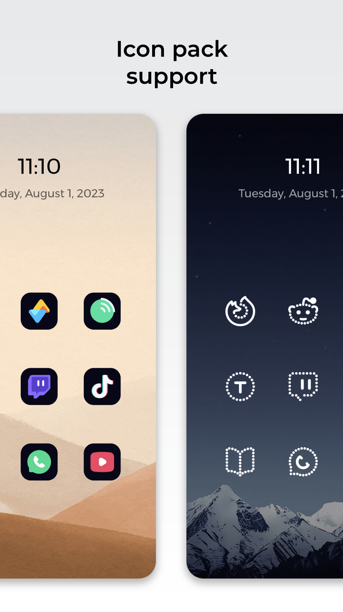
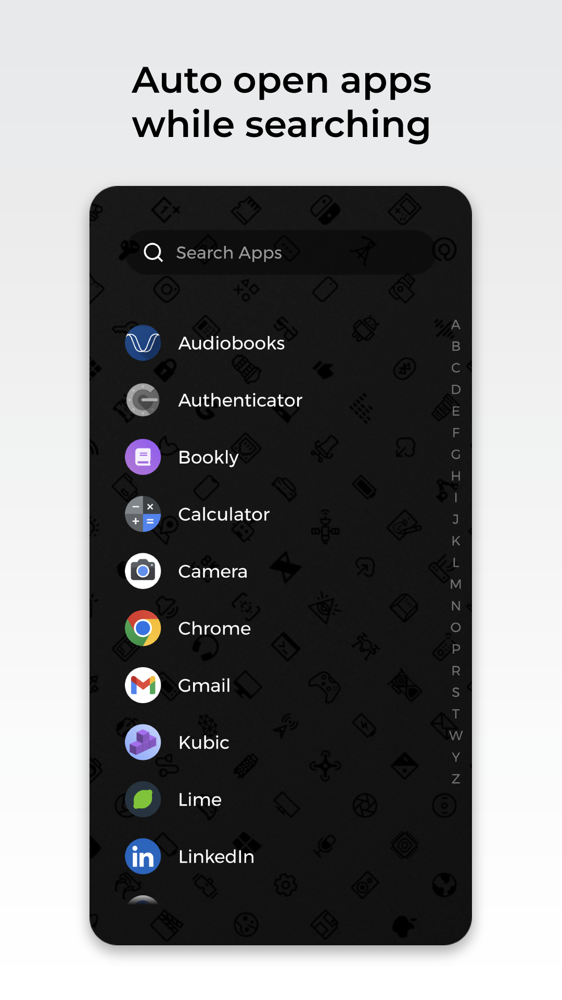
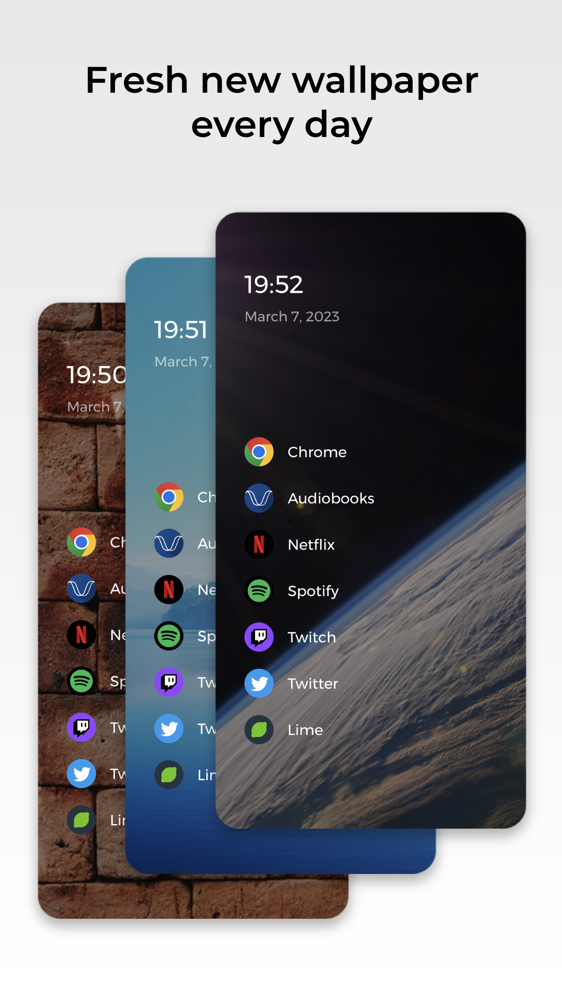
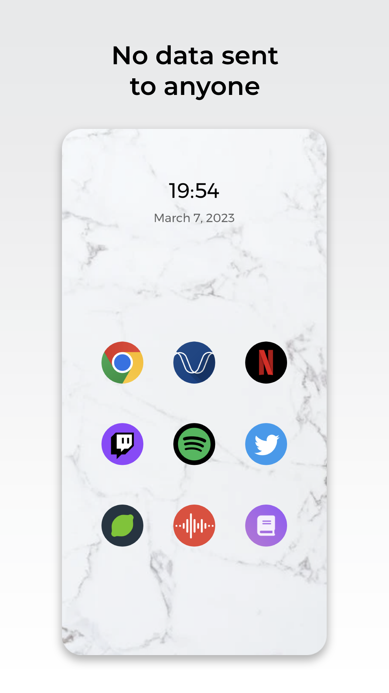
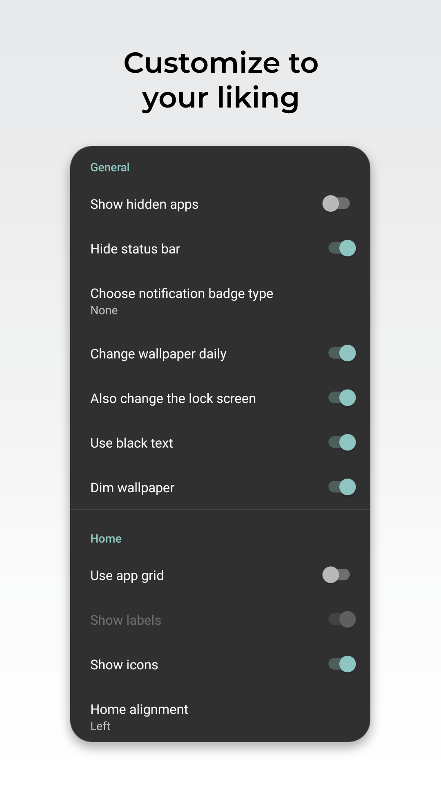

# Lime Launcher

## Short description

Clean and efficient Android launcher with strong privacy and no ads.

## Screenshots

## Long description

Introducing Lime Launcher - the minimalistic Android launcher that puts simplicity and efficiency first. With a clean and straightforward design, this launcher makes it easy to access and organize your apps.

Some of the key features of Lime Launcher include:

- A clean and uncluttered home screen that puts your most important apps front and center.
- A powerful app drawer that lets you quickly search and automatically open apps.
- A strong emphasis on privacy, with no data ever being sent to anyone and the code being open source.
- No ads to distract or disrupt your experience.
- A new fresh wallpaper every day to keep your home screen looking fresh.
- Icon pack support to customize your home screen to your liking.

Whether you're looking for a launcher that's easy to use or one that simply gets out of your way, Lime Launcher is the perfect choice. So if you want a minimalistic, hassle-free experience on your Android device that also prioritizes your privacy and is ad-free, give Lime Launcher a try today!

## Development

**Debug using ADB**

1. Install ADB
   `brew install android-platform-tools`

2. Connect your device via USB and run
   `adb devices`

3. Create a Logs.txt file and copy its path (Right click on the file and select "Copy as path")

4. Clear the logs
   `adb logcat -c`

5. Run the following command
   `adb logcat -v time > <path to Logs.txt>`
